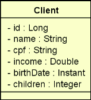

# Spring React Bootcamp - Challenge 1

### You will have to deliver a Spring Boot 2.4.x project containing a full CRUD of REST web services to access a client resource containing the five basic operations learned in the chapter:
<br>

- Resources paged search
- Resource search by id
- Insert new resource
- Update resource
- Delete resource

<br>

### A client has a name, CPF, income, date of birth and number of children. The Client entity specification is shown below:

<p align="center">
  
</p>

<br>

## 🗂️ Challenge resources

### Resources paged search
- GET /clients?page=0&linesPerPage=6&direction=ASC&orderBy=name

### Resource search by id
- GET /clients/1

### Insert new resource
- POST /clients
```json
{
  "name": "Maria Silva",
  "cpf": "12345678901",
  "income": 6500.0,
  "birthDate": "1994-07-20T10:30:00Z",
  "children": 2
}
```

### Update resource
- PUT /clients/1
```json
{
  "name": "Maria Silvaaa",
  "cpf": "12345678901",
  "income": 6500.0,
  "birthDate": "1994-07-20T10:30:00Z",
  "children": 2
}
```

### Delete resource
- DELETE /clients/1
